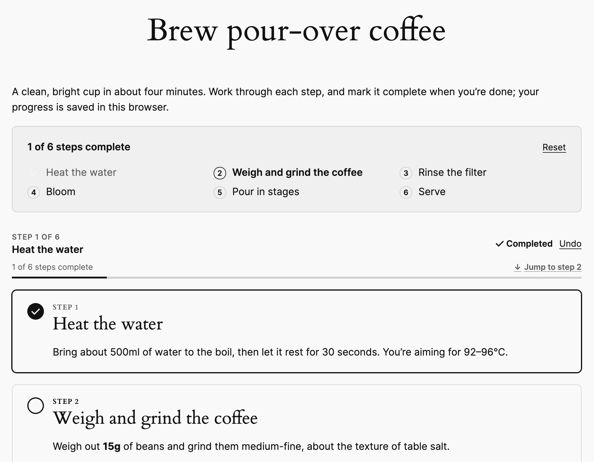
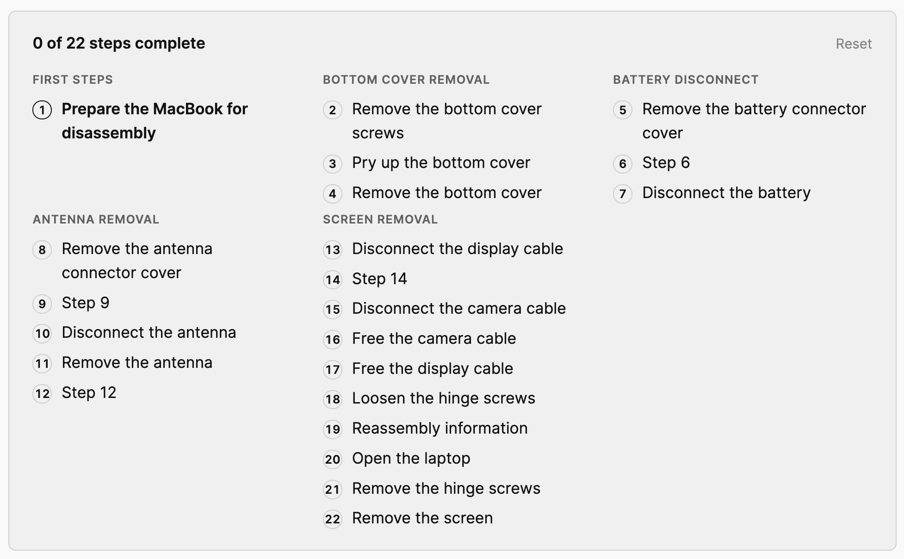
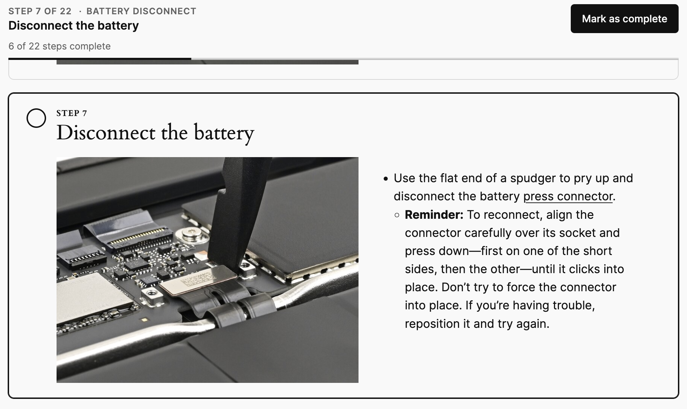

# Process Blocks

Step-by-step process blocks for WordPress - useful for runbooks, checklists, and how-to guides you work through repeatedly.

[](https://playground.wordpress.net/?blueprint-url=https://raw.githubusercontent.com/humanmade/process-blocks/main/blueprint.json)



## How it works

Process Blocks adds a new Process block to the WordPress block editor, allowing viewers to follow a step-by-step process.

Progress through steps is stored in the user's local storage, allowing persistent tracking of progress - a summary checklist allows quickly jumping to the next step. A "reset" button allows restarting the process again for easy repeatable processes.

Each step can contain arbitrary blocks, allowing for rich media directly in each step to assist users.

### Grouping

Steps can be grouped together into sections, allowing better clarity for longer complex processes.




### Sticky header

A sticky header follows the process as a user scrolls through. The convenient "Mark as complete" button allows completing a step and moving to the next one.



Plus, if you scroll away or reload the page, the quick "jump to step" link allows you to resume from your latest incomplete step.


## Theming

Styles are minimal and inherit from the theme. Buttons use the theme's `.wp-element-button` styles; colours derive from `currentColor` and presets. Override these custom properties on `.wp-block-process-blocks-process` to customise:

| Property | Default |
| --- | --- |
| `--process-blocks--accent` | `var(--wp--preset--color--primary, currentcolor)` |
| `--process-blocks--surface` (sticky bar background) | `var(--wp--preset--color--base, canvas)` |
| `--process-blocks--border` | `currentcolor` at 15% |
| `--process-blocks--muted` (summary background) | `currentcolor` at 4% |
| `--process-blocks--radius` | `0.5rem` |
| `--process-blocks--gap` | `var(--wp--style--block-gap, 1.5rem)` |


## Development

Requires Node 22 (see `.nvmrc`), Composer, and Docker (for wp-env).

```sh
npm install
composer install
npm run dev
```

`npm run dev` builds the plugin and starts [wp-env](https://developer.wordpress.org/block-editor/reference-guides/packages/packages-env/) at http://localhost:8888 (log in with `admin` / `password`). Demo pages are created on start:

- http://localhost:8888/process-demo/ (sections)
- http://localhost:8888/process-demo-simple/ (flat steps)
- http://localhost:8888/ifixit-screen-replacement/ (a long real-world guide, adapted from iFixit under CC BY-NC-SA; see [`demo/README.md`](demo/README.md))

Use `npm start` to rebuild on changes, and `npm run env:stop` to stop.

### Without Docker

```sh
npm run playground
```

This builds the plugin and runs it in [WordPress Playground](https://wordpress.github.io/wordpress-playground/) locally, with the same demo content, at http://127.0.0.1:9400.

### Linting

Follows the [Human Made coding standards](https://engineering.hmn.md/standards/).

```sh
npm run lint      # All
npm run lint:js   # ESLint (@humanmade/eslint-config)
npm run lint:css  # Stylelint (@humanmade/stylelint-config)
npm run lint:php  # PHPCS (humanmade/coding-standards)
```

## License

Licensed under the GPL v2 or later. Copyright 2026 Human Made.

Demo content includes [MacBook Neo Screen Replacement](https://www.ifixit.com/Guide/MacBook+Neo+Screen+Replacement/210539) by Nick Schultz on [iFixit](https://www.ifixit.com/), and is licensed under [CC BY-NC-SA 3.0](https://creativecommons.org/licenses/by-nc-sa/3.0/).
